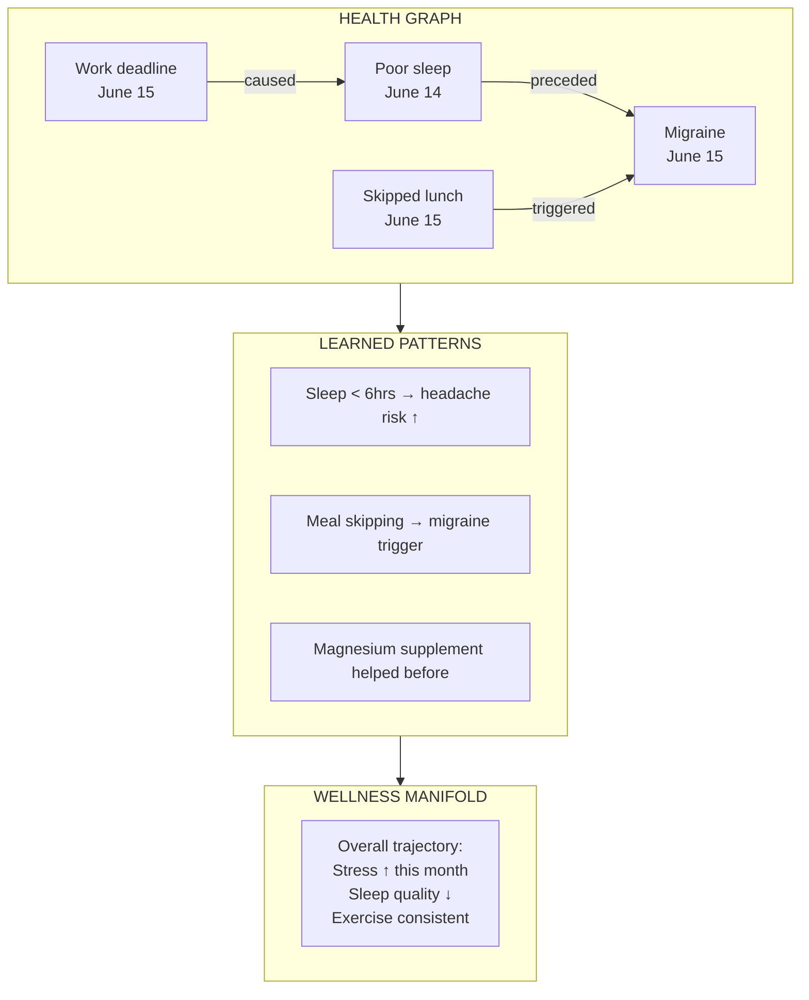
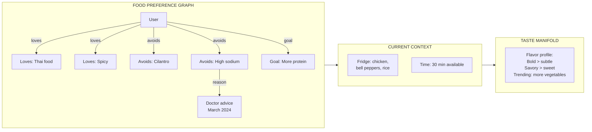
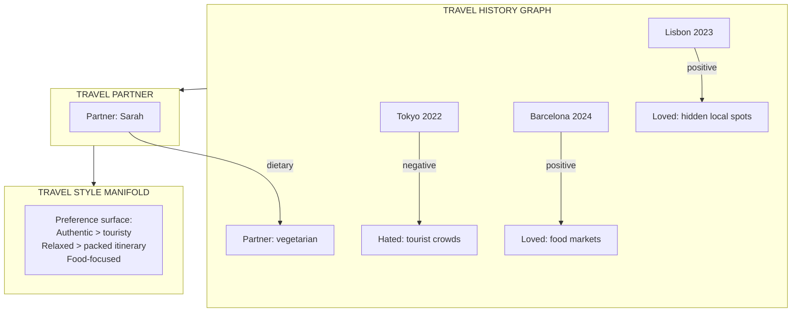
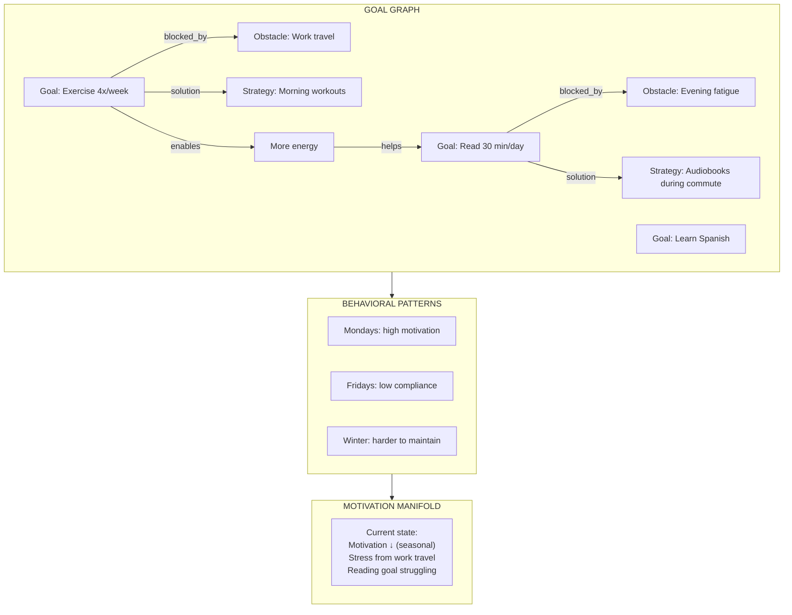
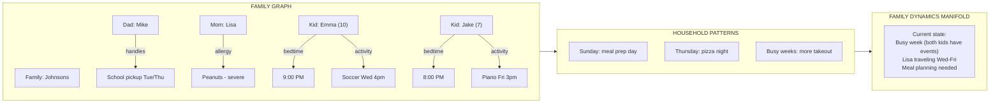

# Real World Examples

LLMs & AI agents have "shallow" memory (Mem0 or Letta), which store facts or summaries. We support multi-hop reasoning, and enables AI to understand context, causality, and preference evolution over time. **This is the breakthrough.** Our memory system doesn’t just store facts, it learns the shape of knowledge itself. This is not incremental improvement, it’s a step toward human-like AI memory and reasoning.

To illustrate the practical value of this architecture, we present several concrete lifestyle scenarios where the hybrid memory system enables truly personalized, context-aware AI assistance.

---

## High Level Comparisons

**1. Personalized Health & Fitness Tracking**

- Traditional AI: Stores past workouts and diet logs as discrete entries or vectors. Retrieval is based on similarity (“last time you ran 5km”) but cannot generalize.
- Cognifold hybrid system: Builds a **semantic surface of fitness and health preferences**, combined with a **graph of events and relationships**.

**Capabilities:**

- Smoothly adapts recommendations based on trends: e.g., noticing that the user tends to skip cardio on Mondays → proactively suggests lighter strength workouts instead.
- Can infer new combinations: If “User prefers morning yoga + low-sugar breakfast” → suggests an unseen “morning yoga + green smoothie” plan, even if it hasn’t been explicitly logged.
- Tracks long-term evolution: Graph layer remembers events (“injury in March”) and manifold adjusts preferences accordingly.

**Why traditional systems fail:**

- Vector-only memory cannot infer new combinations or adapt preferences over time.
- Rewrite-based memory might summarize past workouts but can’t interpolate or evolve personalized rules.

**2. Personal Productivity & Task Management**

- Traditional AI: Knows tasks as isolated items or a list of priorities. Can remind you of deadlines but cannot reason about dependencies or emerging patterns.
- Hybrid system: Graph encodes tasks, deadlines, dependencies; manifold tracks latent traits like “preferred work patterns” or “focus times”.

**Capabilities:**

- Suggests optimal work sequences: “Since you usually do deep work after coffee and prefer tackling high-priority tasks first, start with X before Y.”
- Anticipates future behavior: If a new task resembles past tasks in the manifold, it can automatically create subtasks or recommend resources.
- Handles multi-hop reasoning: Knows “Task A → Task B → Task C” dependencies and adjusts deadlines dynamically.

**Why traditional systems fail:**

- Vector-only systems: Can find similar tasks but cannot reason about dependencies or long-term patterns.
- Graph-only or rewrite-based: Can track dependencies but can’t generalize or infer new behaviors.

**3. Personal Finance & Budgeting**

- Traditional AI: Stores past transactions and budgets as discrete entries. Can alert overspending or categorize items.
- Cognifold hybrid system: Graph stores transaction types and relationships (recurring bills, investments, debts), manifold encodes latent traits like spending preferences, risk tolerance, or saving habits.

**Capabilities:**

- Proactively suggests optimized financial plans: “Since you prefer low-risk investments and usually transfer surplus to savings after the 10th of each month, schedule automatic transfers accordingly.”
- Detects patterns across time: Recognizes “tends to overspend when stressed” → adjusts recommendations.
- Can infer new behaviors: Suggests an alternative plan for unexpected income or expense based on learned preferences.

**Why traditional systems fail:**

- Vector-only AI: Can retrieve similar transactions but cannot reason about sequences or evolving financial preferences.
- Rewrite-based memory: Summarizes past spending but cannot predict or interpolate future patterns.

**4. Lifestyle & Entertainment Recommendations**

- Traditional AI: Suggests movies or restaurants based on previous choices (nearest-neighbor search).
- Hybrid system: Graph encodes relationships (“likes sci-fi → prefers complex plot → avoids horror”), manifold encodes latent taste preferences.

**Capabilities:**

- Suggests experiences never tried but aligned with taste: e.g., a new sci-fi book with certain plot complexity the user likes.
- Adapts over time: Learns subtle changes in taste or context (“tends to pick lighter movies on Fridays”) → recommendations evolve.
- Combines multiple dimensions: Mood, time of day, friends’ preferences, and past patterns all influence recommendation.

**Why traditional systems fail:**

- Vector-only systems: Recommend items that are “closest” but fail to consider complex latent preferences or multi-factor context.
- Graph-only systems: Can encode relations but cannot generalize to unseen combinations or adapt smoothly over time.

**5. Conversational Personal Assistant**

- Traditional AI: Can recall facts like “your favorite coffee shop is X” or “last appointment was at 3 PM.”
- Hybrid system: Graph stores events, appointments, and relationships between entities; manifold encodes user habits, personality traits, and preferences.

**Capabilities:**

- Context-aware responses: “Since you usually schedule meetings after 10 AM, I’ve blocked the early slot and suggested your preferred location.”
- Predictive behavior: Recognizes patterns in mood, energy, and productivity → tailors suggestions or reminders dynamically.
- Multi-session memory: Can reason across months or years without explicit re-entry, adapting its behavior gradually.

**Why traditional systems fail:**

- Vector-only systems: Can retrieve similar facts but can’t reason across time or synthesize patterns.
- Rewrite-based memory: Summarizes previous interactions but can’t maintain continuous evolving user preferences.

---

## Detailed Technical Examples

### Example 1: Personal Health & Wellness Companion

**Scenario**: A user has been tracking their health with an AI companion for several months.

**Traditional Limitation**: Health apps store isolated data points. They cannot connect symptoms to triggers, track how interventions worked, or adapt recommendations to the user's evolving patterns.

**Hybrid Memory Solution**:

**User**: "I have a headache again"

**System Response**:

- **Graph**: Links this headache to last night's 5-hour sleep and skipped breakfast
- **Vector**: Retrieves similar past episodes and what helped
- **Continuous Geometric Substrate/Manifold**: Notes stress trending upward, sleep quality declining

> "I see you slept only 5 hours and skipped breakfast—both patterns that preceded your last 3 migraines. Your stress levels have been elevated this week. Last time, the magnesium supplement and a 20-minute nap helped. Would you like me to remind you about lunch today?"

---

### Example 2: Personalized Recipe & Meal Planning

**Scenario**: A user wants dinner suggestions from their AI kitchen assistant.

**Traditional Limitation**: Recipe apps match keywords but don't know the user's taste evolution, what's in their fridge, or that they're trying to eat less sodium after a doctor's visit.

**Hybrid Memory Solution**:

**User**: "What should I make for dinner?"

**System Response**:

- **Graph**: Knows loves Thai + spicy, avoids cilantro, reducing sodium, wants more protein
- **Vector**: Finds recipes matching available ingredients
- **Continuous Geometric Substrate/Manifold**: Taste profile favors bold, savory flavors; recent trend toward more vegetables

> "How about a Thai basil chicken stir-fry? You have chicken and bell peppers, it's ready in 25 minutes, hits your spicy preference, and I'll use coconut aminos instead of soy sauce to keep sodium low. I've left out the cilantro. Want me to add extra vegetables since you've been enjoying those lately?"

---

### Example 3: Intelligent Travel Companion

**Scenario**: A user is planning a trip and wants personalized recommendations.

**Traditional Limitation**: Travel apps show generic "top 10" lists. They don't know the user hates crowds, loved that quiet café in Lisbon, or that they're traveling with a partner who has dietary restrictions.

**Hybrid Memory Solution**:

**User**: "We're going to Rome next month. Any suggestions?"

**System Response**:

- **Graph**: Knows user loves hidden spots, hates crowds, partner is vegetarian, both love food markets
- **Vector**: Finds Rome experiences similar to enjoyed past trips
- **Continuous Geometric Substrate/Manifold**: Travel style favors authentic, relaxed, food-focused experiences

> "Based on your travel style, skip the Colosseum at peak hours—go at 8am or get the underground tour for fewer crowds. You'll love Testaccio food market (like the one you enjoyed in Barcelona). For Sarah, I've found three highly-rated vegetarian trattorias in Trastevere, which has that 'hidden local' feel you loved in Lisbon. Want me to build a relaxed 4-day itinerary?"

---

### Example 4: Personal Goals & Habit Tracking

**Scenario**: A user is working on multiple personal goals with an AI life coach.

**Traditional Limitation**: Goal apps track streaks but don't understand why the user failed last Tuesday, how goals interact, or that their motivation patterns are seasonal.

**Hybrid Memory Solution**:

**User**: "I keep failing at my reading goal"

**System Response**:

- **Graph**: Links reading failures to evening fatigue; notes exercise enables more energy which helps reading
- **Vector**: Finds similar past struggles and what worked
- **Continuous Geometric Substrate/Manifold**: Detects seasonal motivation dip, current stress from travel

> "I notice your reading drops off in evenings when you're tired—especially after travel weeks. Here's what's worked before: audiobooks during your commute (you finished 3 books that way). Also, your exercise has been consistent, and historically when you exercise in the morning, you have more evening energy for reading. Want to try pairing them? Morning workout → evening reading as a wind-down ritual?"

---

### Example 5: Family Coordination & Household Memory

**Scenario**: A family uses an AI assistant to manage their household.

**Traditional Limitation**: Shared calendars show events but don't know that Dad handles school pickups on Tuesdays, Mom is allergic to peanuts, or that the kids have different bedtimes.

**Hybrid Memory Solution**:

**User**: "What do we need to plan for this week?"

**System Response**:

- **Graph**: Lisa traveling Wed-Fri, Emma has soccer Wed, Jake has piano Fri, Mike handles pickups
- **Vector**: Finds similar past busy weeks and how family managed
- **Continuous Geometric Substrate/Manifold**: Detects this is a high-complexity week requiring extra coordination

> "Busy week ahead! Lisa's traveling Wed-Fri, so Mike—you'll need to cover all pickups. Emma's soccer is Wednesday at 4pm (conflicts with your usual meeting, should I suggest rescheduling?). Jake's piano is Friday at 3pm. For meals: I'd suggest meal prepping Sunday since Lisa won't be here to cook. Thursday is pizza night anyway. Remember: no peanuts in any packed lunches for Emma's class due to a classmate's allergy. Want me to create a shared checklist?"

---

### Summary: When Each Layer Helps

| Use Case                       | Vector Helps | Graph Helps | Manifold Helps |
| ------------------------------ | ------------ | ----------- | -------------- |
| Find similar past situations   | ✓            |             |                |
| Track cause → effect           |              | ✓           |                |
| Remember relationships         |              | ✓           |                |
| Personalize over time          |              |             | ✓              |
| Detect patterns & triggers     |              | ✓           |                |
| Generalize to new situations   | ✓            |             | ✓              |
| Explain "why this advice"      |              | ✓           |                |
| Adapt to seasonal/life changes |              |             | ✓              |

The hybrid architecture shines when applications require **all three capabilities together**—which is essential for any AI system that must truly understand a person's life, not just answer isolated questions.
