# Foundational Hybrid Discrete–Continuous Memory Architecture for LLMs and Agents

## Introduction

Large Language Models (LLMs) and autonomous agents are fundamentally constrained by limited context windows and retrieval systems that rely on decontextualized embeddings, lacking the metacognitive layer to assess relevance, temporal significance, or causal relationships between retrieved information; not to mention whose semantic fidelity degrades over time.

Many memory-augmented architectures rely on retrieval pipelines built atop flat vector stores or linear logs of prior interactions, as seen in Mem0’s [research paper](https://arxiv.org/abs/2504.19413) and [architecture](https://mem0.ai/research). [Letta](https://www.letta.com/blog/agent-memory) introduced a multi-layered memory architecture—combining message buffers, core memory blocks, recall memory, and archival storage—with intelligent eviction policies, recursive summarization, and asynchronous sleep-based consolidation. While these innovations improve memory management, they do not address deeper representational constraints.

Current systems share several foundational limitations:

- **Static Embedding Spaces**: Memories are encoded as fixed vectors that cannot adapt or evolve unless explicitly rewritten, leading to semantic drift and stale representations over time.
- **Discrete Memory Units**: Information is fragmented into symbolic units (messages, blocks, database entries), preventing smooth interpolation, continuous updating, or gradual transformation across related memory traces.
- **Dual Representational Substrates**: Architectures maintain a rigid separation between symbolic memory (structured logs, blocks) and geometric memory (vector embeddings), lacking a unified substrate in which both forms of knowledge can coexist and co-evolve.
- **Context-Window Bottleneck**: All retrieved or summarized information must ultimately pass through a finite context window, creating a structural bottleneck that summarization heuristics can only partially alleviate.
- **Absence of Manifold Structure**: Memories typically exist as isolated points in vector space rather than as elements of a coherent, continuous manifold that supports richer generalization, interpolation, and long-horizon reasoning.

Thus, contemporary memory-augmentation approaches improve retrieval and compression but fail to address the central representational challenge: memory remains a static collection of vectors and text fragments rather than a dynamic, evolving geometric structure capable of supporting long-term adaptive intelligence.

Two further gaps limit these systems:

1. **Lack of Unification**: Memory is treated either as a retrieval system of embeddings or as a graph of symbolic relations—but not both within a single, unified representational substrate.
2. **Lack of Continuity**: Existing systems seldom model the continuous geometric structure of memory—such as embeddings that evolve over time, manifold-based knowledge representations, or memory fields that support smooth interpolation and contextual generalization.

---

## Related Work

### Memory-Augmented Neural Networks

The integration of external memory with neural architectures has a rich history. **Neural Turing Machines** (Graves et al., 2014) and **Differentiable Neural Computers** (Graves et al., 2016) introduced differentiable read/write operations over external memory matrices. However, these architectures operate over fixed-size memory slots and lack the relational structure needed for complex reasoning.

### Retrieval-Augmented Generation (RAG)

RAG systems (Lewis et al., 2020) augment LLMs with retrieved passages from a document corpus. While effective for knowledge-intensive tasks, standard RAG treats memory as a flat collection of text chunks, losing relational and temporal structure. Extensions like **GraphRAG** (Microsoft, 2024) incorporate graph-based retrieval but typically maintain separate retrieval paths rather than a unified substrate.

### Knowledge Graph Embeddings

Methods like TransE, RotatE, and ComplEx learn continuous embeddings for knowledge graph entities and relations. These enable link prediction and analogical reasoning but are typically trained offline and do not support dynamic memory updates or integration with LLM context windows.

### Agent Memory Systems

Recent agent frameworks have introduced sophisticated memory architectures:

- **MemGPT/Letta** (Packer et al., 2023): Hierarchical memory with message buffers, core memory, and archival storage, managed through LLM-driven memory operations
- **Mem0** (2024): Graph-enhanced memory with entity extraction and relation modeling
- **Generative Agents** (Park et al., 2023): Memory streams with retrieval based on recency, importance, and relevance

Our work extends these approaches by introducing a continuous geometric substrate that co-evolves with the discrete graph structure, enabling smooth interpolation and dynamic embedding evolution.

### Geometric Deep Learning

Graph Neural Networks (GNNs) and geometric deep learning provide theoretical foundations for learning on non-Euclidean domains. Our architecture draws on these principles, treating the memory graph as a domain for message-passing and the embedding space as a learned manifold.

---

## Memory Types for AI Systems

LLM-based memory systems require three complementary forms of memory, each serving distinct cognitive functions:

### Semantic Memory (Vector-Based)

Semantic memory stores meaning through dense vector representations. Embeddings capture the distributional semantics of concepts, enabling:

- **Fuzzy recall**: retrieve related concepts even without exact matches
- **Analogy**: find items with similar semantic relationships
- **Clustering**: group related memories by meaning
- **Relevance ranking**: score memories by semantic proximity to queries

This layer excels at answering "what is similar to X?" but lacks explicit relational structure.

### Episodic & Declarative Memory (Graph-Based)

Episodic and declarative memory stores explicit facts, events, and relationships as a labeled graph:

- **Nodes**: entities, preferences, tasks, events, concepts
- **Edges**: typed relationships (`prefers`, `caused`, `before`, `related_to`, `contradicts`)

This layer excels at:

- **Persistent user preferences**: "User prefers function declarations"
- **Temporal ordering**: "Event A happened before Event B"
- **Dependency chains**: "Task X depends on Task Y"
- **Explainable recall**: trace exactly which facts contributed to an answer

### Latent Trait Memory (Continuous Surfaces)

Latent trait memory models high-level tendencies using smooth mathematical objects—personality-like priors that emerge from accumulated interactions:

- **Personalization**: stable user profiles that influence all responses
- **Agent identity**: consistent behavioral tendencies across sessions
- **Behavioral clustering**: map user patterns into continuous dimensions

This layer captures what the graph and vectors cannot: emergent, smoothed preferences that generalize beyond any single stored fact.

### The Three-Layer Memory Model


| Memory Type      | Representation       | Ideal For                                |
| ---------------- | -------------------- | ---------------------------------------- |
| **Semantic**     | Embeddings (vectors) | Fuzzy recall, analogy, relevance ranking |
| **Episodic**     | Graph (nodes/edges)  | Facts, preferences, temporal chains      |
| **Latent Trait** | Continuous surface   | Personalization, identity, stable priors |

---

## Proposed Approach: A Foundational Hybrid Discrete–Continuous Memory Architecture

In this work, I propose a **Foundational Hybrid Discrete–Continuous Memory Architecture** for LLMs and agents, in which memory is both symbolically structured and embedded within a continuous geometric field.

Specifically:

- We represent memories as **nodes and edges in a graph** to capture explicit semantic, causal, temporal, and hierarchical relationships.
- Simultaneously, we embed these nodes (and potentially edges) into a **continuous vector or geometric space** (e.g., manifold embeddings) that supports smooth transitions, proximity-based reasoning, interpolation of novel states, and effective retrieval through latent structure.

By integrating these two substrates—**graph + geometric field**—we enable richer reasoning, more flexible generalization, and persistent, evolving memory across sessions, agents, and tasks.

This hybrid architecture provides several key advantages:

- the graph enables explicit relational querying;
- the geometric embedding enables latent reasoning and similarity search;
- the mapping between these representations allows fluid movement from symbolic reasoning to geometric generalization.

Under this formulation, memories are not isolated entries but components of a semantic map embedded within a continuous cognitive field—supporting both discrete link traversal and smooth latent transitions.

---

## Architecture Overview

The following diagram illustrates the high-level architecture of the hybrid memory system:

```mermaid
flowchart TB
    subgraph HMA["HYBRID MEMORY ARCHITECTURE"]
        subgraph Substrates[" "]
            direction LR
            subgraph DS["DISCRETE SUBSTRATE<br/>(Knowledge Graph)"]
                A((A)) -->|causal| B((B))
                A -->|temporal| C((C))
                B -->|temporal| D((D))
                C <-->|semantic| D
            end

            subgraph CS["CONTINUOUS SUBSTRATE<br/>(Geometric Manifold)"]
                E1((●)) --- E2((●))
                E2 --- E3((●))
                E3 --- E4((●))
                E4 --- E5((●))
                E1 --- E4
                E2 --- E5
            end

            DS <-->|"φ / φ⁻¹"| CS
        end

        subgraph BL["BRIDGE LAYER"]
            B1["Node ↔ Embedding"]
            B2["Edge ↔ Direction"]
            B3["Path ↔ Trajectory"]
        end

        subgraph QI["QUERY INTERFACE"]
            Q1["Symbolic<br/>(Graph)"]
            Q2["Geometric<br/>(Vector)"]
            Q3["Hybrid<br/>(Unified)"]
        end

        Substrates --> BL
        BL --> QI
    end

    style DS fill:#e1f5fe,stroke:#01579b
    style CS fill:#f3e5f5,stroke:#4a148c
    style BL fill:#fff3e0,stroke:#e65100
    style QI fill:#e8f5e9,stroke:#1b5e20
```



### System Components

The Hybrid Memory Architecture comprises five core components:

```mermaid
flowchart TB
    subgraph Components["SYSTEM COMPONENTS"]
        subgraph SEL["1. SEMANTIC EMBEDDING LAYER"]
            SEL_D["Converts inputs into embeddings<br/>Stored in vector index for ANN search"]
        end

        subgraph GML["2. GRAPH MEMORY LAYER"]
            GML_D["Stores entities, tasks, preferences, relationships<br/>Nodes contain embeddings for cross-layer linkage"]
        end

        subgraph LPM["3. LATENT PREFERENCE MANIFOLD"]
            LPM_D["Long-term preferences as differentiable surface<br/>Acts as personalized 'bias field' over retrieval"]
        end

        subgraph CRE["4. CROSS-LAYER RETRIEVAL ENGINE"]
            CRE_D["Vector → Graph → Surface pipeline<br/>Ranks and synthesizes results"]
        end

        subgraph MUE["5. MEMORY UPDATE ENGINE"]
            MUE_D["Extracts entities and relations<br/>Updates vectors, graph structure, and manifold"]
        end
    end

    SEL --> CRE
    GML --> CRE
    LPM --> CRE
    MUE --> SEL
    MUE --> GML
    MUE --> LPM

    style SEL fill:#e3f2fd,stroke:#1565c0
    style GML fill:#e8f5e9,stroke:#2e7d32
    style LPM fill:#f3e5f5,stroke:#7b1fa2
    style CRE fill:#fff3e0,stroke:#ef6c00
    style MUE fill:#fce4ec,stroke:#c2185b
```



| Component                      | Function                                                                 |
| ------------------------------ | ------------------------------------------------------------------------ |
| **Semantic Embedding Layer**   | Convert inputs to embeddings; store in vector index for ANN search       |
| **Graph Memory Layer**         | Store entities, preferences, relationships; nodes linked to embeddings   |
| **Latent Preference Manifold** | Model long-term preferences as differentiable surface; bias retrieval    |
| **Cross-Layer Retrieval**      | Vector → Graph → Surface pipeline; rank and synthesize results           |
| **Memory Update Engine**       | Extract entities/relations; update vectors, graph, and manifold together |

### Substrate Interaction Model

The discrete and continuous substrates are not independent stores but co-evolving representations linked through a **Bridge Layer**:

```mermaid
flowchart LR
    subgraph Discrete["DISCRETE (Graph)"]
        N["Node nᵢ<br/>(memory unit)"]
        E["Edge eᵢⱼ<br/>(relation)"]
        P["Path P<br/>(n₁→n₂→...→nₖ)"]
    end

    subgraph Bridge["BRIDGE"]
        PHI["φ(nᵢ)<br/>(encoder)"]
        PSI["ψ(eᵢⱼ)<br/>(encoder)"]
        GAMMA["Γ(P)<br/>(compose)"]
    end

    subgraph Continuous["CONTINUOUS"]
        V["vᵢ ∈ ℝᵈ<br/>(embedding)"]
        R["rᵢⱼ ∈ ℝᵈ<br/>(relation vector)"]
        T["trajectory τ<br/>(manifold curve)"]
    end

    N --> PHI --> V
    E --> PSI --> R
    P --> GAMMA --> T

    style Discrete fill:#e3f2fd,stroke:#1565c0
    style Bridge fill:#fff8e1,stroke:#f57f17
    style Continuous fill:#f3e5f5,stroke:#7b1fa2
```



**Inverse Mapping (Continuous → Discrete):**

```mermaid
flowchart LR
    subgraph Input["Input"]
        Q["Query point q<br/>(vector)"]
        V["Interpolated v'<br/>(novel point)"]
    end

    subgraph Process["Process"]
        NN["NN(q)<br/>(search)"]
        DEC["decode<br/>(φ⁻¹)"]
    end

    subgraph Output["Output"]
        NS["{nᵢ | sim > θ}<br/>(node set)"]
        SN["synthetic node n'<br/>(inferred memory)"]
    end

    Q --> NN --> NS
    V --> DEC --> SN

    style Input fill:#e8f5e9,stroke:#2e7d32
    style Process fill:#fff3e0,stroke:#ef6c00
    style Output fill:#fce4ec,stroke:#c2185b
```



---

## Formal Specification

### Definition 1: Hybrid Memory State

A **Hybrid Memory State** \( \mathcal{M} \) is a tuple:

\[
\mathcal{M} = (G, \mathcal{E}, \phi, \psi, \mathcal{I})
\]

where:

- \( G = (N, E, \lambda_N, \lambda_E) \) is a labeled directed multigraph with nodes \( N \), edges \( E \), node labels \( \lambda_N: N \to \Sigma_N \), and edge labels \( \lambda_E: E \to \Sigma_E \)
- \( \mathcal{E} \subseteq \mathbb{R}^d \) is the embedding manifold
- \( \phi: N \to \mathcal{E} \) is the node embedding function
- \( \psi: E \to \mathbb{R}^d \) is the edge embedding function (optional)
- \( \mathcal{I} \) is the index structure supporting efficient retrieval over \( \mathcal{E} \)

### Definition 2: Edge Types

The edge label alphabet \( \Sigma_E \) includes at minimum:

| Edge Type      | Semantics                                           | Example                                |
| -------------- | --------------------------------------------------- | -------------------------------------- |
| `CAUSAL`       | \( n_i \) caused or led to \( n_j \)                | "User clicked button" → "Modal opened" |
| `TEMPORAL`     | \( n_i \) occurred before \( n_j \)                 | Event sequencing                       |
| `SEMANTIC`     | \( n_i \) is semantically related to \( n_j \)      | Concept similarity                     |
| `HIERARCHICAL` | \( n_i \) is a parent/child of \( n_j \)            | Category membership                    |
| `EPISODIC`     | \( n_i \) and \( n_j \) co-occurred in same episode | Session grouping                       |

### Definition 3: Memory Operations

The memory system supports the following atomic operations:

```
INSERT(content, metadata, relations) → node_id
  Creates a new node, computes embedding, updates graph and index

UPDATE(node_id, content?, metadata?, embedding?)
  Modifies existing node; triggers embedding recomputation if content changes

LINK(source_id, target_id, edge_type, weight?)
  Creates or updates an edge between nodes

DELETE(node_id)
  Removes node and all incident edges; updates index

QUERY_SYMBOLIC(pattern) → {nodes}
  Graph pattern matching (e.g., Cypher-like queries)

QUERY_GEOMETRIC(vector, k, threshold?) → {(node, score)}
  k-NN search in embedding space

QUERY_HYBRID(pattern, vector, α) → {(node, score)}
  Weighted combination: score = α·symbolic_score + (1-α)·geometric_score
```

---

## Semantic Surfaces: Memory as Geometry

A key insight of this architecture is that long-term memory need not be stored as discrete facts in a table, but as **smooth surfaces in high-dimensional embedding space**. Instead of "User prefers X" being a row in a database, it becomes a _region_ in meaning-space.

### What Is a Semantic Surface?

A **semantic surface** is a smooth geometric shape inside the model's embedding space that represents how a concept relates to other concepts. Rather than storing isolated vectors, we model memory as a continuous manifold where:

- **Individual facts** are points on the surface
- **Preferences and patterns** are regions of the surface
- **Associations** are captured by surface curvature and proximity

Consider a user who:

- Prefers function declarations over arrow functions
- Works primarily with TypeScript
- Values explicit, readable code

Rather than storing three separate bullet points, the system forms a _surface_ in "coding preferences space" that encodes: "User prefers explicit structure → strong bias away from arrow syntax → favors function declarations." This surface enables correct behavior inference even for cases not explicitly stored.

### Bézier Parametric Representation

We propose using **Bézier surfaces** to define these semantic manifolds. A Bézier surface is a mathematical construction that defines a smooth, controllable surface using a small set of **control points**.

```mermaid
flowchart LR
    subgraph BS["BÉZIER SURFACE MODEL"]
        subgraph CP["Control Points (learned)"]
            P1((P₁))
            P2((P₂))
            P3((P₃))
            P4((P₄))
        end

        subgraph SF["Semantic Surface"]
            S["Smooth interpolated<br/>preference manifold"]
        end

        subgraph QR["Query Region"]
            Q["Novel query<br/>lands on surface"]
        end

        CP --> SF
        SF --> QR
    end

    style CP fill:#e3f2fd,stroke:#1565c0
    style SF fill:#f3e5f5,stroke:#7b1fa2
    style QR fill:#e8f5e9,stroke:#2e7d32
```



This representation offers several advantages:

| Property          | Benefit                                                                                                        |
| ----------------- | -------------------------------------------------------------------------------------------------------------- |
| **Smoothness**    | Memory transitions are gradual, not jagged or abrupt                                                           |
| **Local control** | Adjusting one control point affects only the local region—updating a memory doesn't distort unrelated memories |
| **Interpolation** | The model can infer behavior for unseen cases by interpolating on the surface                                  |
| **Compactness**   | Store 4–16 control points instead of thousands of discrete facts                                               |

### Memory Updates as Surface Deformation

When new information arrives ("remember that I prefer X"), the system adapts the control points of the Bézier surface:


- New information pulls on specific control points
- The semantic surface adjusts smoothly
- Future queries that land near that region of the surface are influenced
- You aren't changing a fact—you're _deforming a surface_ that influences reasoning

### Intuition: The Rubber Sheet Analogy

Imagine memory as a soft rubber sheet stretched in high-dimensional space:

| Concept                   | Analogy                                       |
| ------------------------- | --------------------------------------------- |
| **Facts**                 | Points on the sheet                           |
| **Preferences**           | Whole regions of the sheet                    |
| **Updating memory**       | Gently pulling on the sheet with your fingers |
| **Bézier control points** | Your fingers                                  |
| **The sheet**             | Semantic surface                              |
| **The deformation**       | How the model updates its behavior            |

This model makes memory:

- **Continuous**: not discrete entries that must be exactly matched
- **Generalizable**: the model can interpolate, not just recall
- **Stable**: small updates don't break the whole memory
- **Compressible**: Bézier surfaces need only a few control points to define complex shapes

---

## Memory Dynamics

### Embedding Evolution

Unlike static vector stores, embeddings in this architecture can evolve through several mechanisms:

```mermaid
flowchart TB
    subgraph EEM["EMBEDDING EVOLUTION MODEL"]
        subgraph ABD["1. ACCESS-BASED DRIFT"]
            ABD_F["vᵢ(t+1) = vᵢ(t) + η · ∇_access"]
            ABD_D["Frequently accessed memories<br/>drift toward query distribution"]
        end

        subgraph RP["2. RELATIONAL PROPAGATION"]
            RP_F["vᵢ(t+1) = (1-β) · vᵢ(t) + β · Σⱼ wᵢⱼ · vⱼ(t)"]
            RP_D["Embeddings influenced by<br/>graph neighbors (message passing)"]
        end

        subgraph TD["3. TEMPORAL DECAY"]
            TD_F["salience(nᵢ, t) = base_salience · e^(-λ(t - t_last_access))"]
            TD_D["Unused memories fade;<br/>can be consolidated or archived"]
        end

        subgraph CON["4. CONSOLIDATION (Sleep-like)"]
            CON_D["Periodic background process:"]
            CON_1["• Merge similar nodes"]
            CON_2["• Strengthen frequently co-activated paths"]
            CON_3["• Prune low-salience nodes"]
            CON_4["• Re-embed based on accumulated context"]
        end
    end

    ABD --> RP --> TD --> CON

    style ABD fill:#e3f2fd,stroke:#1565c0
    style RP fill:#e8f5e9,stroke:#2e7d32
    style TD fill:#fff3e0,stroke:#ef6c00
    style CON fill:#f3e5f5,stroke:#7b1fa2
```



---

## Retrieval Strategies

### Hybrid Query Processing

```mermaid
flowchart TB
    Q["Input Query Q"] --> QP["Query Parser"]

    QP --> GQ["Graph Query"]
    QP --> EQ["Embedding Query"]

    GQ --> GM["Graph Match"]
    EQ --> KNN["k-NN Search"]

    GM --> FL
    KNN --> FL

    subgraph FL["FUSION LAYER"]
        SCORE["score = α·graph_score + (1-α)·vector_score<br/>+ γ·path_bonus + δ·recency_bonus"]
    end

    FL --> RR["Re-Ranker<br/><i>Optional: cross-encoder or LLM-based reranking</i>"]

    RR --> CE["Context Expansion<br/><i>Expand results with graph neighborhood<br/>Follow high-weight edges</i>"]

    CE --> M["Retrieved Memory Set M*"]

    style Q fill:#e1f5fe,stroke:#0277bd
    style FL fill:#fff8e1,stroke:#f9a825
    style M fill:#c8e6c9,stroke:#2e7d32
```



### Multi-Hop Reasoning via Graph Traversal

For queries requiring relational reasoning, the system supports **graph-guided retrieval**:

> **Query:** _"What happened after the user mentioned budget constraints?"_

```mermaid
flowchart TB
    subgraph Step1["Step 1: Vector Search"]
        VS["Find 'budget constraints' memory node"]
    end

    subgraph Step2["Step 2: Graph Traversal"]
        N1["🗣️ User mentioned<br/>budget is $50k"]
        N2["🤖 Agent proposed<br/>Plan B option"]
        N3["✅ User approved<br/>Plan B"]

        N1 -->|TEMPORAL| N2
        N2 -->|CAUSAL| N3
    end

    subgraph Step3["Step 3: Return Result"]
        RES["Return trajectory as<br/>contextualized memory"]
    end

    Step1 --> Step2 --> Step3

    style N1 fill:#e3f2fd,stroke:#1565c0
    style N2 fill:#fff3e0,stroke:#ef6c00
    style N3 fill:#e8f5e9,stroke:#2e7d32
```



---

## Why Graph + Vector, Not Pure Geometry

A natural question arises: why not use a purely continuous representation—such as a learned manifold or Bézier surface—as the primary memory substrate? While geometrically elegant, such approaches face fundamental limitations in practice.

### Graphs Encode Human-Like Memory Structure

Human memory is fundamentally relational, not geometric. Consider the following memory fragments:

- "User prefers function declarations over arrow functions"
- "This relates to TypeScript style conventions"
- "This is a persistent, high-confidence preference"

These are naturally expressed as typed edges in a graph. A continuous surface must encode such relationships implicitly through geometric proximity, which becomes brittle and opaque as the memory grows.

### Local Updates Without Global Deformation

When updating a control point on a continuous surface (e.g., Bézier, spline, or learned manifold):

- Nearby regions deform unpredictably
- Memory interference occurs across semantically unrelated areas
- Isolating changes requires complex constraints

In contrast, graph updates are:

- **Local**: adding an edge affects only incident nodes
- **Deterministic**: no gradient-based side effects
- **Composable**: new facts integrate without distorting existing structure

### Interpretability and Provenance

Graph-based memory supports natural introspection:

- _"Why did you answer that?"_ → trace the retrieval path
- _"Which facts influenced this?"_ → list contributing nodes
- _"Where did that memory come from?"_ → follow provenance edges

Continuous surfaces offer no such affordances—they are opaque mathematical objects that resist symbolic inspection.

### Industry Convergence

The retrieval-augmented agent memory pattern has emerged as the de facto standard across major systems (OpenAI, Anthropic, LangChain, MemGPT, etc.):

> **Embeddings → Vector Store (semantic) → Graph (structured) → Reasoning**

This architecture succeeds because it combines the strengths of both substrates without forcing either to handle tasks it's poorly suited for.

### Where Continuous Geometry Still Helps

Continuous representations remain valuable for:

- **Summarized latent traits**: personality vectors, user profiles
- **Smooth preference interpolation**: blending between related concepts
- **Learned default biases**: priors that evolve over time

In our architecture, the geometric manifold serves these purposes—it is a _complement_ to the graph, not a replacement. This yields a three-layer conceptual model:

| Layer              | Representation     | Purpose                                      |
| ------------------ | ------------------ | -------------------------------------------- |
| **Vector Layer**   | Embeddings         | Local meaning, semantic similarity           |
| **Graph Layer**    | Nodes + Edges      | Explicit structure, relationships, causality |
| **Manifold Layer** | Continuous surface | High-level traits, smooth interpolation      |

The graph provides explicit structure; the vector layer enables fuzzy matching; the manifold layer captures emergent, smoothed preferences learned over time. Together, they form a more complete memory system than any single substrate could alone.

---

## Comparison with Existing Approaches

| Capability            | Vector DB (e.g. RAG) | Knowledge Graph Only | Hybrid (Proposed) |
| --------------------- | :------------------: | :------------------: | :---------------: |
| Semantic Similarity   |          ✓           |          ○           |         ✓         |
| Explicit Relations    |          ✗           |          ✓           |         ✓         |
| Multi-hop Reasoning   |          ✗           |          ✓           |         ✓         |
| Smooth Interpolation  |          ○           |          ✗           |         ✓         |
| Evolving Embeddings   |          ✗           |          ✗           |         ✓         |
| Temporal Ordering     |          ✗           |          ✓           |         ✓         |
| Causal Chains         |          ✗           |          ✓           |         ✓         |
| Latent Generalization |          ✓           |          ✗           |         ✓         |
| Unified Query API     |          ─           |          ─           |         ✓         |

> **Legend:** ✓ = strong support, ○ = partial, ✗ = not supported, ─ = N/A

---

## Contributions

We demonstrate how this hybrid memory system surpasses purely vector-based or purely graph-based memory approaches in agent tasks requiring long-term coherence, multi-hop reasoning, and cross-modal generalization. Our contributions are:

1. **A formal specification** of the hybrid discrete–continuous memory substrate, including graph structure, vector manifold embedding, update semantics, and retrieval strategies.
2. **A theoretical framework** for embedding evolution and memory dynamics that enables continuous adaptation rather than static storage.
3. **Evaluation methodology** for tasks requiring sustained memory, relational reasoning, and long-term persistence, with expected improvements in coherence and memory reuse compared with baseline systems.

---

## Evaluation Framework

To validate the hybrid architecture, we propose evaluation across three dimensions:

### Benchmark Tasks

| Task Category              | Description                                                 | Metrics                                       |
| -------------------------- | ----------------------------------------------------------- | --------------------------------------------- |
| **Long-term Coherence**    | Multi-session dialogues requiring recall of earlier context | Factual accuracy, contradiction rate          |
| **Multi-hop Reasoning**    | Questions requiring traversal of 2+ memory relations        | Answer correctness, path validity             |
| **Temporal Reasoning**     | Queries about event ordering and causality                  | Sequence accuracy, causal inference           |
| **Cross-session Transfer** | Knowledge reuse across distinct task episodes               | Transfer efficiency, retrieval precision      |
| **Memory Efficiency**      | Scalability under growing memory corpus                     | Latency, memory footprint, index rebuild time |

### Baselines

- **RAG-only**: Standard vector retrieval (e.g., LangChain + Chroma/Pinecone)
- **Graph-only**: Pure knowledge graph with no embedding layer (e.g., Neo4j + Cypher)
- **Mem0**: Hybrid but with static embeddings and simpler graph structure
- **Letta/MemGPT**: Tiered memory with summarization but no geometric substrate

### Expected Outcomes

We hypothesize the hybrid architecture will demonstrate:

1. **+15-25% accuracy** on multi-hop reasoning vs. vector-only baselines
2. **Reduced hallucination** through explicit relational grounding
3. **Smoother generalization** to novel queries via manifold interpolation
4. **Better long-term retention** through evolving embeddings and consolidation

---

## Limitations and Future Work

### Current Limitations

- **Computational Overhead**: Maintaining dual representations increases storage and update complexity
- **Embedding-Graph Synchronization**: Keeping embeddings consistent with graph structure during rapid updates requires careful design
- **Cold Start**: New agents lack the graph structure needed for relational reasoning until sufficient interactions accumulate
- **Hyperparameter Sensitivity**: The fusion weight \( \alpha \) and evolution rates require tuning per domain

### Future Directions

1. **Learned Fusion**: Replace fixed \( \alpha \) with a learned attention mechanism that dynamically weights symbolic vs. geometric retrieval based on query type
2. **Hierarchical Manifolds**: Extend flat embedding space to hierarchical or hyperbolic manifolds for better representation of taxonomic relationships
3. **Multi-Agent Memory Sharing**: Enable memory graphs to be composed or federated across agent instances while preserving privacy boundaries
4. **Neuromorphic Consolidation**: Explore biologically-inspired memory consolidation during agent "sleep" phases, including replay and synaptic pruning analogues
5. **Provenance Tracking**: Extend the graph schema to track memory provenance, enabling agents to reason about the reliability and source of their memories

---

## Conclusion

By positioning this memory layer as foundational infrastructure, we aim to provide a core substrate for next-generation LLMs and agents—one that supports relational, continuous, and evolving memory rather than short-term context windows or ad hoc logs. We believe this hybrid discrete–continuous architecture will become a key building block in the future of cognitive AI systems.

The key insight is that memory should not be a passive store but an active, structured, and evolving cognitive resource—one that bridges the gap between symbolic reasoning and geometric generalization. This work takes a step toward that vision by proposing a unified architecture that treats discrete graph structure and continuous embedding space as complementary, co-evolving substrates of a single memory system.
